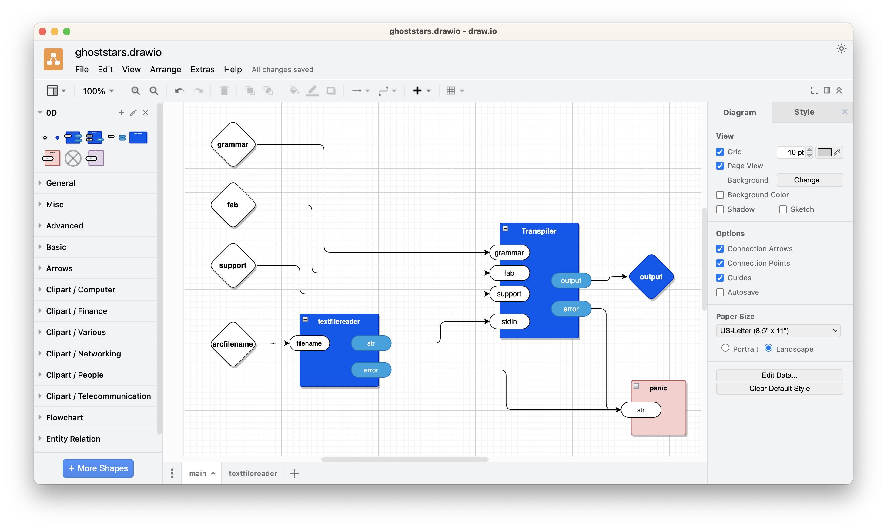

Demo of using Drawware to transpile a game script into JSON.

# Usage
- edit the diagram `ghoststars.drawio` (and save)
- `make`

# Tour
For this experiment, I've included all of the `odin0d` code in with the `ghostars` text.

For this experiment, I've hand-built a `Transpiler` component in Odin which calls Ohm-JS and Fab to do the transpilation.  This can probably be done better, but I had to start somewhere...

## Main


## Textfilereader

![[textfilereader.png]]

## Input Files:
- `grammar.ohm`
- `fabricate.fab`
- `support.js`
- `src.txt`

See the appendices for the contents of the above files.

## Tabs on the Diagram
- `main`
- `textfilereader`

`Main` is the main entry point of the executable code[^main].

`Main` contains 4 inputs and one output and one use of the `panic` component.

`Main` contains 2 components
- Transpiler
- textfilereader.

Transpiler has 4 inputs and 2 outputs.  In this experiment, `Transpiler` is coded as a Leaf in the package `leaf0d` which calls out to a JavaScript routine that invokes Ohm-JS[^ohmjs] and Fab[^fab].

`Textfilereader` is a Container component that has 1 input and 2 outputs.  It invokes 2 Leaf components, `Open Text File` and `Read Text From FD` which are coded in Odin (leaf0d/...), for this experiment.

`Textfilereader` also contains a superfluous use of the `?` component to show how it might be used.  In this case the incoming string on the port `filename` is dumped to the console.  This has no effect on the operation of the rest of the code.

Note that not all of the output ports fire every time.  In the case of `textfilereader`, for example, only one output port fires
- `str` sends a `string` if the file read was successful, but sends nothing if there was an error
- `error` sends a `string` if the open or the file read were unsuccessful, but sends nothing if the file was read successfully.

The fact that a port fires can be put to good use in the design of the program.  In some cases, you only need to know that a port fired and don't care about the contained data.  In EE, this kind of design is called 'edge-triggered'.  In EE, one can observe the *leading* edge and the *trailing* edge.  In this software implementation, one can only observe a *pulse* with no specific edges, i.e. the software can only know if the port was fired or not, but, cannot know obtain further information about the firing, like beginning-edge-of-firing vs. trailing-edge-of-firing.

![[README 2023-08-12 07.41.03.excalidraw]]

[^main]: The name `main` is arbitrary and can be passed in as a command-line argument.  See `main.odin`.

[^ohmjs]: https://ohmjs.org/
[^fab]: https://github.com/guitarvydas/fab

## 0D Palette
The component palette is on the left sidebar of the draw.io tool.  This is called the *view>>shapes* sidebar.  The palette is labelled `0D`.

The palette, ideally, should contain every Leaf component.  Currently, it only contains a few parts that I dragged onto it manually.

The red part `panic` causes an Odin assertion failure.  For this experiment, I don't care much about errors, so I simply dump all errors into `panic`. The demo works or it fails, no further nuance.

The purple `?` component is a debugging *probe*.  It can be used to watch data coming out of output ports.  It can be used to 
1. set up a test bench
2. debug drawware programs.

In this experiment, I've stuck a `?` component in the `textfilereader` component.  This `?` is entirely superfluous here and is included only for expository purposes.  Note that *probing* requires that *fan-out* be allowed at the technical level.  *Fan-out* brings along with it some technical challenges, like how to make a copy of a message and/or how to sample a message.  In electronics, probes suck a tiny bit of current away from the circuit.  In EE, it is important to design probes such that they are *high impedance*, which means that they suck only a inconsequential amount of current away from the circuit and don't affect the performance of the circuit.  In software, I choose to clone() the message.  There might be other ways to accomplish this, but, I haven't figured them any yet.  Anyways, copying is trivial if you use a GC'ed language, like Python, JS, Lisp, etc.  Odin does not support automatic GC, so one has to design the kernel code (0d/...) carefully to avoid memory leaks.

The circled-`X` icon is meant for future "type-checking" of NC (No Connection) connections.  This kind of checking is not currently implemented.

## Odin0D Packages
- 0d/
- process/
- registry0d/
- syntax/
- user0d/
- ./fabghoststars

### 0D
The implementation of 0D using the Odin programming language.

Each component is described by a data structure called *eh*.

The system treats every component, Container or Leaf, as a tiny state machine with 2 states
1. idle
2. active.

Each component, Container or Leaf, has exactly 1 input queue and exactly 1 output queue.  Messages are placed on the queues and processed by the component at its own speed.

Each message contains 2 fields
1. port
2. datum.

The *port* is a tag.  The *datum* is any kind of data.  The *port* tag allows the receiving component break down the purpose of an incoming message, or, to queue up an output message with a given purpose.  The actual meaning of *port* tags depends on the project and on the hard-coded implementation of Leaf components.

A component is essentially like a stand-alone mini-processor with internal memory.  Each component reacts to one input message at a time and must complete its reaction to a particular message before advancing to the next message.  Note that a reaction might include mutation of some instance data (saved state) without producing any output.  Reactions are meant to be "short" and "quick" and might leave full-blown processing of events to a later date.  

Note that components are activated for *every* input message.  Unlike other so-called *dataflow* technologies, inputs are not automatically accumulated and synchronized.  The component must perform that kind of work itself, when necessary (but, most often, this is not necessary).

Container components can contain:
- Container components
- Leaf components.

Leaf components do not contain other components.  Leaf components contain *code* written in some underlying language.  In this experiment, we use the Odin language.  See the *future* section for ideas about using other underlying languages, like Rust, Python, Common Lisp, JavaScript, etc.

A Container component can be thought of as a mini-operating-system, without the need for extra bloatware to handle MMUs, TRAPs, etc.  In this perspective, 0D Drawware can be thought of as a way to compose mini-operating systems into full-blown solutions (note the similarity to internet and Arduinos and robotics and blockchain and ...).

Most components - Container or Leaf - "just run".  In some cases, though,Leaf components need to do I/O and/or to break out to already-existing code written in a synchronous, long-running manner in some other way.  In such cases, these particular Leaf components need to be coded up by systems programmers and must use the `set_idle` and `set_active` entry points to change components' state.  This technique requires another discussion and will be described in another essay (it is not difficult, but, is on another branch of some other repo)

### Process
Odin implementation of spawning a process with a string command and collecting output sent as a string.
### Registry0D
Table of Leaf and Container components that are available in the diagram and hard-coded in the underlying language (Odin, in this case).
### Syntax
XML parser that converts .drawio files into internal Odin-accessible form.

The parser recognizes
- rectangles
- text
- arrows
- ellipses
- rhombuses
- .drawio diagram as a series of Tabs
	- each Tab represents a Container component
	- each Blue rectangle represents a Leaf component
	- each empty rhombus represents an input port
	- each blue rhombus represents an output port.

Most everything else is ignored.  This makes it possible to put "comments" on the diagram.  Currently, we use draw.io sticky-notes for comments, by convention.  The shortcut key is `s`. 

### Leaf0D
Contains the code (Odin in this case) for Leaf nodes that are available for use in the project.

Each Leaf is described by 2 Odin routines
1. `..._instantiate`
2. `..._proc`.

The `..._proc` (2) procedure is the message handler, which is invoked at runtime every time the component receives a message.

The `..._instantiate` (1) procedure is called during build time, i.e. 'load time', just before the program begins to run.  A Leaf component can be instantiated multiple times in a project.  Each instance causes a call to `..._instantiate`.  The instantiator creates a unique name for each instance and binds the `..._proc` message handler to the component instance.

A component instance usually contains instance data.  Due to historic reasons, there are 2 instantiators
1. instantiate simple - create a Leaf component instance with null instance data
2. instantiate with data - create a Leaf component instance with instance data.

In the future, we expect to deprecate the *simple* kind of instantiator and to make *all* instantiations create instances with instance data.  In the edge case of a Leaf needing no instance data, its instantiator will be called with *nil* as its instance data.

In this experiment, we supply the pre-made Leaf components
- `1then2`
	- low-level component for ordering inputs, input 1 is guaranteed to preceed input 2 regardless of possible race conditions
- `?`
	- probe
- `stringconcat`
	- concatenate 2 strings into 1 string
- `panic`
	- Odin assert fail
- `command`
	- shell out to run a command, with no stdin
- `icommand`
	- shell out to run a command, with stdin
- `Read Text File`
	- read a text file given a filename string
- `Read Text From FD`
	- read a text file given a file descriptor
- `Open Text File`
	- open a file in text mode, given a file descriptor
- `Transpiler`
	- given a grammar, a fabrication spec, a support JS file (often empty) and a source text file, produce an output string (a source-to-source transpilation)

Early experimental Leaf components that will be deprecated in the future, but, may serve as inspiration for hard-coded string components:
- `literalgrep`
- `literalvsh`
- `literalpsgrepwcl`
- `literalwcl`
- `hard_coded_ps`
- `hard_coded_grepvsh`
- `hard_coded_wcl`

This package currently contains procedures which parse shell components in an automated manner.  Components that have names that begin with `$` are automatically converted into shell-out commands.  The procedures that automate this process are:
- stdout_instantiate
- stdout_proc
- process_instantiate
- process_proc
- collect_process_leaves.
The current experimental code requires that these routines be appropriately invoked from the mainline (an experimental wart that we will change in some way in the future).

### User0D
Contains 2 procedures that need to be specified for each unique project:
1. `start_logger` returns a boolean true/false
2. `components` appends all Leaf components in the project palette to the procedure argument (a reference to a Registry of leaf initializers)

As mentioned elsewhere, it should be possible to automatically generate the `components` procedure from a GUI or a mini-DSL.  In this experiment, though, we are exploring only the required atomic bits and pieces that are needed to plumb a project together.

### Fabghoststars
- `main.odin`
	- This package is the main entry point

## Ancilliary Program
- transpile

A JavaScript program (https://github.com/guitarvydas/fabghoststars/blob/main/transpile) that invokes Ohm-JS twice (once to parse the input and once more to parse and act on the fabrication (transpilation) specification SCN (DSL)).

## Overview: Sketch of the Process

In this sketch, we use the convention that
- green boxes represent inputs
- a yellow box represents the output
- a blue ellipse represents the Transpiler component.

Transpile a game script to JSON.
![[ghoststars.svg]]
# Usage
make
# Background
This is a practical test of the `fab` tool.

# Future
- A.I. (Khoj, Llama, etc.) component(s)
- a drawware implementation of a 0D compiler that emits Odin, Python, Common Lisp, JavaScript, etc. code
- a string constant component which the parser recognizes and generates appropriate code for
- replace `user0d.odin` with some kind of mini-DSL or spreadsheet or HTML GUI that automatically generates the necessary code for inclusion in a project
- more game-creation components, Container and Leaf
- more transpilation components, to make source-to-source transpilation easier, e.g. GUIs, etc
- an IDE that supports plugging components together, regardless of the underlying programming language used (probably built with drawware, itself)
- PROLOG, miniKanren, etc. exhaustive search components
- ???

# Appendix - Authors
- Paul Tarvydas - 0d author
- Zac Nowicki - Odin Implementarion ([Kagi](https://kagi.com), [GitHub](https://github.com/z64))
- Ghoststars https://oofoe.itch.io/ghost-stars

# Appendix grammar.ohm
```
GhostStars {
text = macro+

macro =
  | applySyntactic<ShowPhrase>
  | applySyntactic<MovePhrase>
  | applySyntactic<WaitPhrase>
  | applySyntactic<FadeToBlackPhrase>
  | applySyntactic<JumpPhrase>
  | lex_spoken
  | period
  | separator
  | nls
  | any
  
ShowPhrase = "Show" filename "at" Coordinate
MovePhrase = "Move" filename "to" Coordinate TimeSpan
WaitPhrase = "Wait" number "frames"
FadeToBlackPhrase = "Fade" "to" "black" TimeSpan
JumpPhrase = "Jump" ChapterName

lex_spoken = speaker spoken

speaker = speakerSpaces name
speakerSpaces = 
  | "                    " -- spaces20
  | tab tab "    "         -- tabtabspaces4

Coordinate = number "x" number
TimeSpan = "over" number "frames"
ChapterName = name
filename = name

spoken = spokenchar+
spokenchar = ~separator any

period = "."
separator = "❖"

name = nameFirst nameRest*
nameFirst = letter
nameRest = "_" | ":" | digit | nameFirst
number = "-"? digit+

nls = nl+
nl = "\n"
tab = "\t"
}

```
# Appendix fabricate.fab
```
GhostStars {
text [macro+] = ‛\n{ onenter:\n[«macro»true]\n}\n’

macro [x] = ‛«x»’
  
ShowPhrase [kShow filename kat Coordinate] = ‛\n["image","«filename»",«Coordinate»],’
MovePhrase [kMove filename kto Coordinate TimeSpan] = ‛\n["moveto","«filename»",«Coordinate»,«TimeSpan»,"ease in"],’
WaitPhrase [kWait number kframes] = ‛\n["wait",«number»],’
FadeToBlackPhrase [kFade kto kblack TimeSpan] = ‛\n["fadeout",«TimeSpan»],’
JumpPhrase [kJump ChapterName] = ‛\n["jump","«ChapterName»"],’
lex_spoken [speaker spoken] = ‛\n["say","«speaker»«spoken»"],’
speaker [speakerSpaces name] = ‛«speakerSpaces»«name»’
speakerSpaces_spaces20 [spaces] = ‛                    ’
speakerSpaces_tabtabspaces4 [tab1 tab2 spaces4] = ‛                    ’

Coordinate [number1 kx number2] = ‛«number1»,«number2»’
TimeSpan [kover number kframes] = ‛«number»’
ChapterName [name] = ‛«name»’
filename [name] = ‛«name»’

spoken [cs+] = ‛«cs»’
spokenchar [c] = ‛«c»’

name [nameFirst nameRest*] = ‛«nameFirst»«nameRest»’
nameFirst [letter] = ‛«letter»’
nameRest [c] = ‛«c»’
number [kminus? digit+] = ‛«kminus»«digit»’

nls [cs+] = ‛’
nl [c] = ‛«c»’
tab [c] = ‛«c»’
period [c] = ‛’
separator [c] = ‛’
}

```
# Appendix support.js
```
// intentionally left blank
```
# Appendix src.txt
```
❖ Show prolog_bg at 0x-550. Move prolog_bg to 0x0
over 300 frames. Wait 150 frames.

                    CHEL:NA
          The last time I saw
          her... She was smiling. As
          if she had some secret that
          she couldn't wait to tell me.
          
          And then, in a sudden wash of
          red, she was gone.
          
          Gone as if she had never stood
          beneath the uncaring stars.

❖ Fade to black over 43 frames. Jump INTRO.

```

# See Also
### Blogs
- https://publish.obsidian.md/programmingsimplicity (see blogs that begin with a date 202x-xx-xx-)
- https://guitarvydas.github.io/ (up to about mid-2022)
### Videos
https://www.youtube.com/@programmingsimplicity2980
### Books
WIP - leanpub'ed (leanpub encourages publishing books before they are finalized)
https://leanpub.com/u/paul-tarvydas
### Discord
https://discord.gg/Jjx62ypR
### Twitter
@paul_tarvydas
### Mastodon
(tbd, advice needed)
